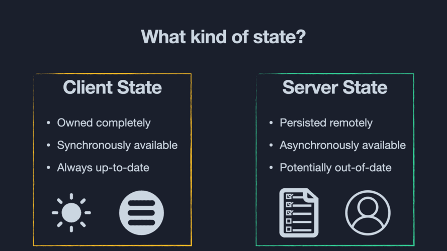

import Attribution from 'components/Attribution'
import Comments from 'components/Comments'
import Translations from 'components/Translations'
import DataFetchingComparison from './data-fetching-comparison.tsx'
import StaleWhileRevalidate from './stale-while-revalidate.tsx'


- <b>#1: Client State vs. Server State</b>
- [#2: Practical React Query 1 - tips and tricks](practical-react-query-1-tips-and-tricks)
- [#3: Practical React Query 2 - custom hooks and query key factory](practical-react-query-2-custom-hooks-and-query-key-factory)

<Translations>{[]}</Translations>

### Comparison between Client State and Server State



- Client State Manager = Redux, Zustand
- Server State = Server Data -> Manager = ???

Before React Query, there were 2 strategies to manage server data:

### Fetch data with Redux + async action

```tsx:title=redux-toolkit-example {20,43-47,50,52-57,59-64,66-71,82,84-86}
import { createAsyncThunk, createSlice } from '@reduxjs/toolkit'
import { RootState } from 'app/store'
import axios from 'axios'
import {CartGetState } from 'models/features'
import cartApi from 'api/cart-api'
import { selectUserDetail } from 'features/auth/user-login-slice'
import { validateToken } from 'features/validateToken'

const initialState: CartGetState = {
  cart: undefined,
  status: 'init',
  failureDescription: ''
}

// The function below is called a thunk and allows us to perform async logic. It
// can be dispatched like a regular action: `dispatch(incrementAsync(10))`. This
// will call the thunk with the `dispatch` function as the first argument. Async
// code can then be executed and other actions can be dispatched. Thunks are
// typically used to make async requests.
export const getCartAsync = createAsyncThunk(
  'cartGet/getCartAsync',
  async (data, {dispatch, getState, rejectWithValue }) => {
    try {
      // console.log('calling get orders')
      const userDetail = selectUserDetail(getState() as RootState)
      validateToken(userDetail, dispatch)
      const response = await cartApi.getLatestCartDetail(userDetail)
      return response
    } catch (error) {
      if (axios.isAxiosError(error)) {
        if (!error.response) {
          throw error
        }
        return rejectWithValue(error.response.data)
      } else {
        throw error
      }
    }
  }
)

const cartGetSlice = createSlice({
  name: 'cartGet',
  initialState,
  reducers: {
    resetCartGet: handleResetAction,
  },
  // The `extraReducers` field lets the slice handle actions defined elsewhere,
  // including actions generated by createAsyncThunk or in other slices.
  extraReducers: (builder) => {
    builder
      .addCase(getCartAsync.pending, (state: CartGetState) => {
        return {
          cart: undefined,
          status: 'loading',
          failureDescription: '',
        }
      })
      .addCase(getCartAsync.fulfilled, (state: CartGetState, action) => {
        return {
          cart: action.payload,
          status: 'idle',
          failureDescription: ''
        }
      })
      .addCase(getCartAsync.rejected, (state: CartGetState, action) => {
        return {
          cart: undefined,
          status: 'failed',
          failureDescription: JSON.stringify(action.payload as Object),
        }
      })
  },
})

function handleResetAction(state: CartGetState) {
  state.cart = undefined
  state.status = 'init'
  state.failureDescription = ''
}

export const { resetCartGet } = cartGetSlice.actions

export const selectCart = (state: RootState) => state.cartGet.cart
export const selectCartStatus = (state: RootState) => state.cartGet.status
export const selectFailureDescription = (state: RootState) =>
  state.cartGet.failureDescription

export const cartGetReducer = cartGetSlice.reducer
```

Initiate data fetching on component mount

```tsx:title=initiate-data-fetching {2}
  useEffect(() => {
    dispatch(getCartAsync())
    dispatch(getAllOrdersAsync())
    dispatch(getListBankAsync())
    dispatch(getPaymentMethodsAsync())
  }, [])
```

> fetch once, distribute globally, rarely update

### Fetch data with useEffect

```tsx:use-effect-example
function CartComponent() {
  const [cart, setCart] = useState(null);
  const [status, setStatus] = useState('loading');

  useEffect(() => {
    // Replace 'fetchCartData' with your actual API request logic
    const fetchCartData = async () => {
        const response = await axios.get('/api/cart'); // Replace with your API endpoint
        setCart(response.data);
        setStatus('idle');
    };

    fetchCartData();
  }, []); // The empty dependency array ensures this effect runs only once

  return ();
}

```

> fetch on every mount, keep it local.

### Problems

There are actually no problems with the above strategies. The important thing is that [IT WORKS]().

The fetch data with useEffect pattern is introduced in the official React docs, and is widely used among newbies developer. It is simple, native and easy to understand.

Fetching data with Redux is also popular among many professional React teams. Redux even has it's own data fetching middleware called [Redux Saga](https://redux-saga.js.org/)

But 'it is working' solely isn't enough, we need better encapsulation and great DX.

<DataFetchingComparison />

### Entering React Query

```tsx:title=useQuery-syntax
function Example() {
  const query = useQuery({
    queryKey: ['your', 'key', 'here'],
    queryFn: () => PROMISE,
  })

  if (query.isLoading) return 'Loading...'
  if (query.error) return 'An error has occurred: ' + error.message
  return (
    <div>(query.data)</div>
  )
}

// With Custom Hook
function useGetData() {
  return useQuery({
    queryKey: ['your', 'key', 'here'],
    queryFn: () => PROMISE,
  })
}
```

With mininal code to get started, React Query solved the above two problems: Bad DX and Encapsulation.

React Query has a cache, and it uses stale-while-revalidate caching mechanism.

### stale-while-revalidate

<StaleWhileRevalidate />

> These defaults are smart and aggressive (Tkdodo).

In my opinion, these defaults help the frontend to display latest data, hence easier to debug and spot errors. What happens if new instances of query do not refetch the latest data? If there are requirements from BA or System Admin, then we can change later.

### Perks of having a cache

If the user goes to a different browser tab, and then comes back to your app, a background refetch will be triggered automatically, and data on the screen will be updated if something has changed on the server in the meantime. All of this happens without a loading spinner being shown, and your component will not re-render if the data is the same as you currently have in the cache.

---

That's it for today. If you have any questions, or just leave a comment below. ⬇️

<Comments />
