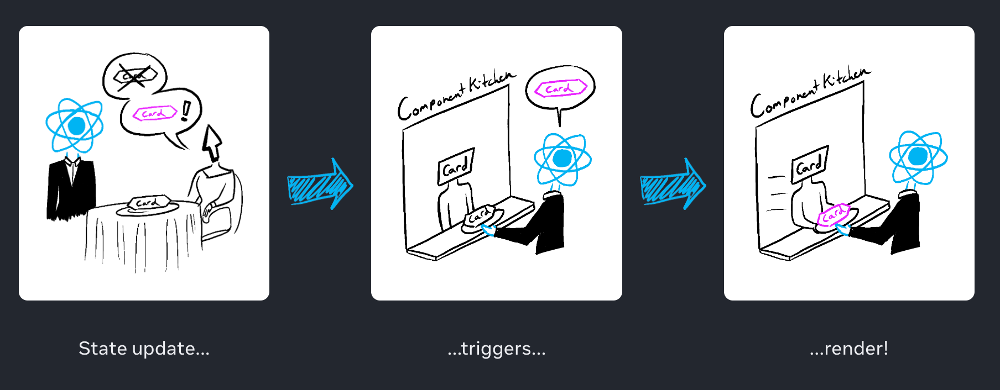
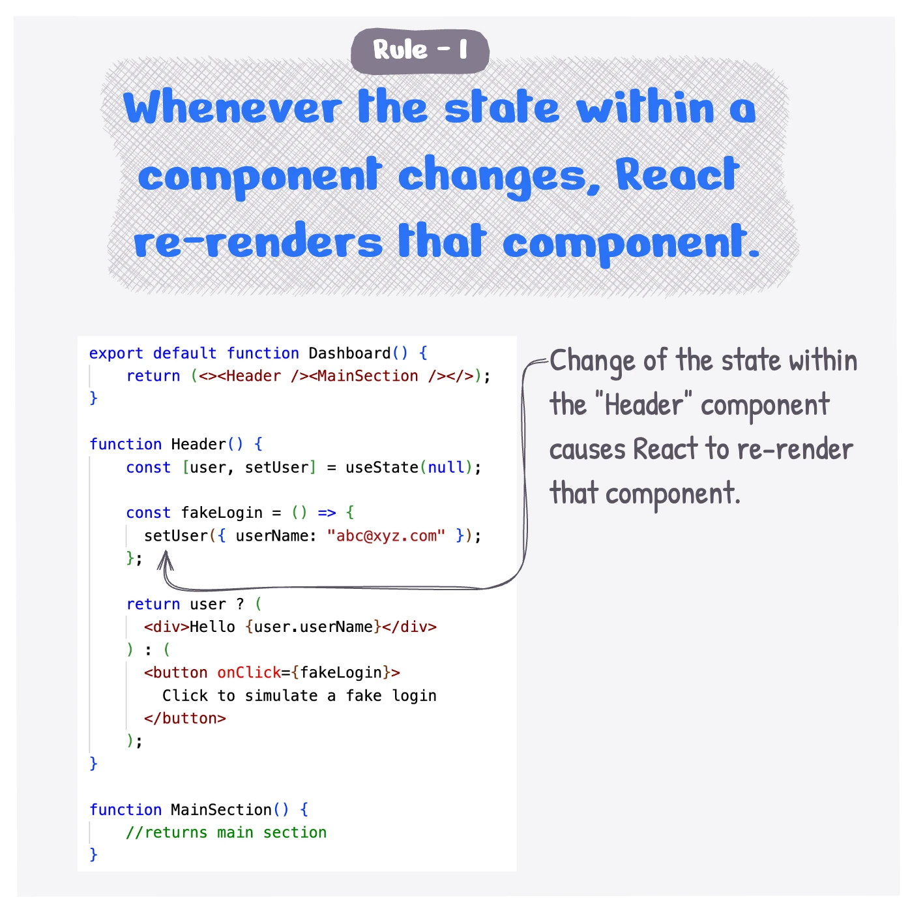
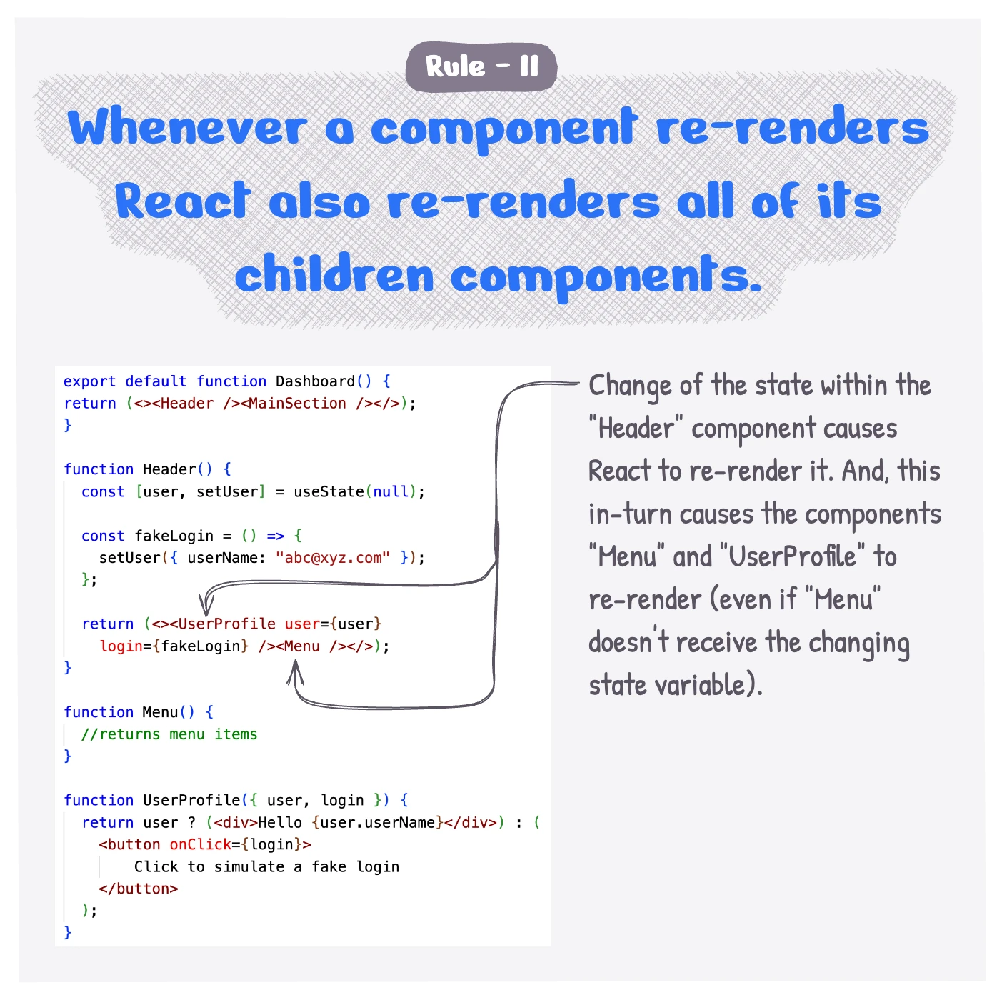

import Attribution from 'components/Attribution'
import Comments from 'components/Comments'
import Translations from 'components/Translations'


- <b>#1: React JS Core</b>
- [#2: In defense of useEffect](putting-props-to-use-state)
- [#3: NextJS Core](next-js-core)

<Translations>{[]}</Translations>

The introduction to my frontend tech stack have to start with React Core. React's [official documentations](https://react.dev/learn) is the best place to start because it is very detailed, interactive and officially developed by the React Team.

For new learners, read all the tabs in [learn React](https://react.dev/learn). Leave out Escape Hatches and any part about Context and Reducer.

## React Primer

For people who are new to React and Frontend Development, I will introduce the following concept as a primer: [SOC Portal](http://10.14.132.42:33001/dashboard)

- **Components**: modern websites are divided into thousands of components. Each component is responsible for displaying its own data, state, and even calling API !

React components are JavaScript functions that return markup.

```jsx:title=Children-Components
function Sidebar() {
  return (
    <aside>Hello from Sidebar</aside>
  );
}
function Main() {
  return (
    <main>Hello from main</main>
  );
}
```

Parent component can return markup and include child component.

```jsx:title=Parent-Component
export default function MyApp() {
  return (
    <div>
      <h1>Welcome to my app</h1>
      <Sidebar />
      <Main />
    </div>
  );
}
```

Children component can have its own children component, until it reach the leaves nodes. The tree from root to leaves nodes is called a **Virtual DOM**.


<Attribution name="Example Virtual DOM" />

- **State**: state is a component's memory.
  > Combination of <strong>Components</strong> and <strong>State</strong> will make up <strong>UI State</strong> or <strong> Application State</strong>. Frontend devs have to take care each of those states. Thanks to component modularity, any possible error will happen inside
  > that component only, hence easier to debug
- **Sharing States / Passing States**: some techniques: passing state as props, lifting state to the parent, global state, context, ...

With just these three concepts, I can almost implement any complex frontend system.

## Pure Function

An important concept in functional programming, a pure function is a function with the following characteristics:

- **Same inputs, same output**: Given the same inputs, a pure function should always return the same result.
- **Does not mutate outside states**: ex. mutate the DOM, api calls, Timeouts, ...

```jsx:title=pure-function
function Cup() {
  return <h2>Tea cup for guest</h2>;
}

function Cup({ guest }) {
  return <h2>Tea cup for guest #{guest}</h2>;
}
```

--

```jsx:title=not-pure-function

// Changing a preexisting variable!
let guest = 0;
function Cup() {
  guest = guest + 1;
  return <h2>Tea cup for guest #{guest}</h2>;
}

// Mutating the DOM or cause side effects in pure function
function Cup() {
  alert("This is an alert message.");
  return <h2>Tea cup for guest</h2>;
}

// Performing async action in pure function
function Cup() {
  const [data, setData] = useState(null);
  fetch('https://api.example.com/data').then((response) => {
    setData(response.data);
  }).catch((error) => {
    console.error('Error fetching data:', error);
  });
  return <h2>{data}</h2>;
}
```

#### Where can I cause side effects?

Side effects include: updating the screen, starting an animation, changing the data, ..

> In React, **side effects** usually belong inside **event handlers** and **useEffect**. However, the use of useEffect should be minimal.

## React Render Process

We are going to dive deep into how React transform our code into real UI, and find out how pure function help with rendering process.


<Attribution name="React Rerender Process" />

### 1. Trigger a render

There are two reasons for a component to render:

- It’s the component’s initial render.
- The component’s (or one of its ancestors’) state has been updated (usually through **event handler** or **useEffect**)


### 2. Render !

After you trigger a render, React calls your components to figure out what to display on screen. **“Rendering” is React calling your components**.

- On initial render, React will call the root component.
- For subsequent renders, React will call the function component whose state update triggered the render.

If the updated component returns some other component, React will render that component's children until it reaches the leaves node.

> Rendering happens so often in React, so that's why we need every React Component to be pure!

### 3. Sync VDOM with DOM

After rendering (calling) your components, React will modify the DOM.

- For the initial render, React will put all the DOM nodes it has created on screen.
- For re-renders, React will apply the minimal necessary operations to make the DOM match the latest rendering output.

### Common Gotchas

When calling setState inside event handlers or in useEffect, some common gotchas:

> React batches state updates. React waits until all code in the event handlers has run before processing your state updates.

> The JSX component is a snapshot of the UI in time. Its props, event handlers, and local variables were all calculated using its state at the time of the render.

```js react-live
function App() {
  const [number, setNumber] = React.useState(0)
  return (
    <>
      <button
        onClick={() => {
          setNumber(number + 1)
          setNumber(number + 1)
          setNumber(number + 1)
        }}
      >
        update
      </button>
      <span style={{ marginLeft: '10px', color: 'black' }}>
        {number}
      </span>
    </>
  )
}

render(<App />)
```

What's the problem with the above code and how to fix it?

```js react-live
function App() {
  const [number, setNumber] = React.useState(0)
  return (
    <>
      <button
        onClick={() => {
          setNumber(number + 5)
          setNumber((n) => n + 1)
        }}
      >
        update
      </button>
      <span style={{ marginLeft: '10px', color: 'black' }}>
        {number}
      </span>
    </>
  )
}

render(<App />)
```

## FYI - 3 rules when React rerender

For new learners, this is good to know for visualizing rendering process and debugging your components. Be sure to check out this awesome [introduction](https://punits.dev/jargon-free-intros/why-react-rerenders-and-when-to-worry-about-it/) and this [blog post](https://kentcdodds.com/blog/usememo-and-usecallback) on why optimize React.





---

That's it for today. If you have any questions, or just leave a comment below. ⬇️

<Comments />

