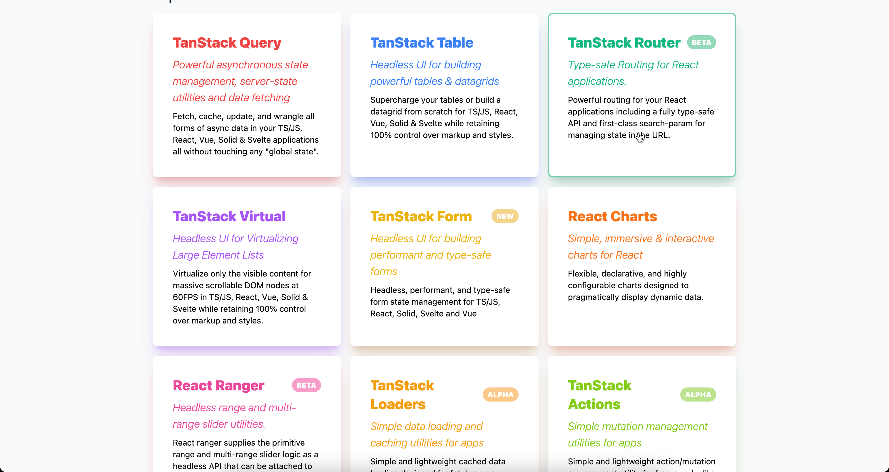

import Comments from 'components/Comments'
import Translations from 'components/Translations'
import Attribution from 'components/Attribution'
import Tweet, {
  AvatarDiegohaz,
  TweetImage,
  UseEvent,
} from 'components/Tweet'

<Translations>{[]}</Translations>

Welcome to the introduction of my front-end tech stack, and it all started with React

## Why React?

Lets look at the web world before React with jQuery and PHP:

<Attribution name="Mutating the DOM with Javascript" />

Let's look at the problems:
- DOM mutations are expensive. This will lead to janky experience or unresponsive pages.
- Links to other pages will reload the whole browser, really slow ... [BIDV](https://www.bidv.net/bidvorg/service/)

React came out in 2013 with SPA architecture, and it has a Virtual DOM to minimize DOM update.

<Attribution name="React with VDOM" />

### Components and JSX

So React allowed us to abstract our UI into components and couple functionality (JS) with markup (HTML) in a declarative, reusable way. This was revolutionary at the time.

Also, React gave us a predictable way to render our UI. Before that, everything we used was a mess (compared to today's standards). We had the choice to either update the DOM manually in an imperative spaghetti mess (jQuery 👀) or wrestle with two-way data binding and a weird templating syntax (👋 angular).

### Popular

Every day, there are so many people just starting out with web development. They look around for what is the best tech to learn right now to get a job. Something that pays the bills and is not terrible to work with. And everything points towards React. Companies have lots of existing React Applications, and are still choosing React for new stuff. It's an easy and safe choice.

<Tweet
  name="Haz"
  handle="ddrsensation"
  tweetId="1618404218347618305"
  avatar={<AvatarDiegohaz />}
  date={new Date('2022-05-07')}
>
  

    The best feature of React is that it pays the bills.
  

</Tweet>

### Ecosystem

React focuses on the view layer and leaves many aspects to the wider JavaScript ecosystem. React literally doesn't care as it provides minimal to no support for: routing, styling, form, dev environment and bundling, state management. Comparing this to the full fledged Web Framework like Angular, the same goes for React Native and its counter-part, Flutter.

React's true strength lies in the extensive community-driven ecosystem that has evolved around it. Solutions for problems are invented, stood the test of time, reinvented and improved years after years. Examples of popular, successful packages that grow into ecosystem of packages:

+ NextJS with Vercel: [dev environment](https://nextjs.org/), [frameworks](https://nextjs.org/), [bundling tool](https://turbo.build/pack), [monorepos](https://turbo.build/repo)
+ Tanstack with @tanstack: [data fetching](https://tanstack.com/query/latest), [tables](https://tanstack.com/table/v8)
+ TailwindCSS with TailwindLabs: [styling](https://tailwindcss.com/), [accessibility](https://headlessui.com/react/combobox), [UI Templates](https://tailwindui.com/)

## My React Tech Stack

Based on my personal experience of 2 years over 2-3 projects and findings on the internet, data-centric application frontends are divided into 5 big modules. Each module and their intertwine can solve most frontend needs.

+ [React Core and NextJS Core](react-core): states, effects, rendering, routes, ...
+ [Styling Module](): CSS, accessibility, design system
+ [Form Module](): user inputs text number dates, mutations
+ [Client State Management](client-state-vs-server-state)
+ [Server State Management](client-state-vs-server-state)

---

That's it for today. If you have any questions, or just leave a comment below. ⬇️

<Comments />
