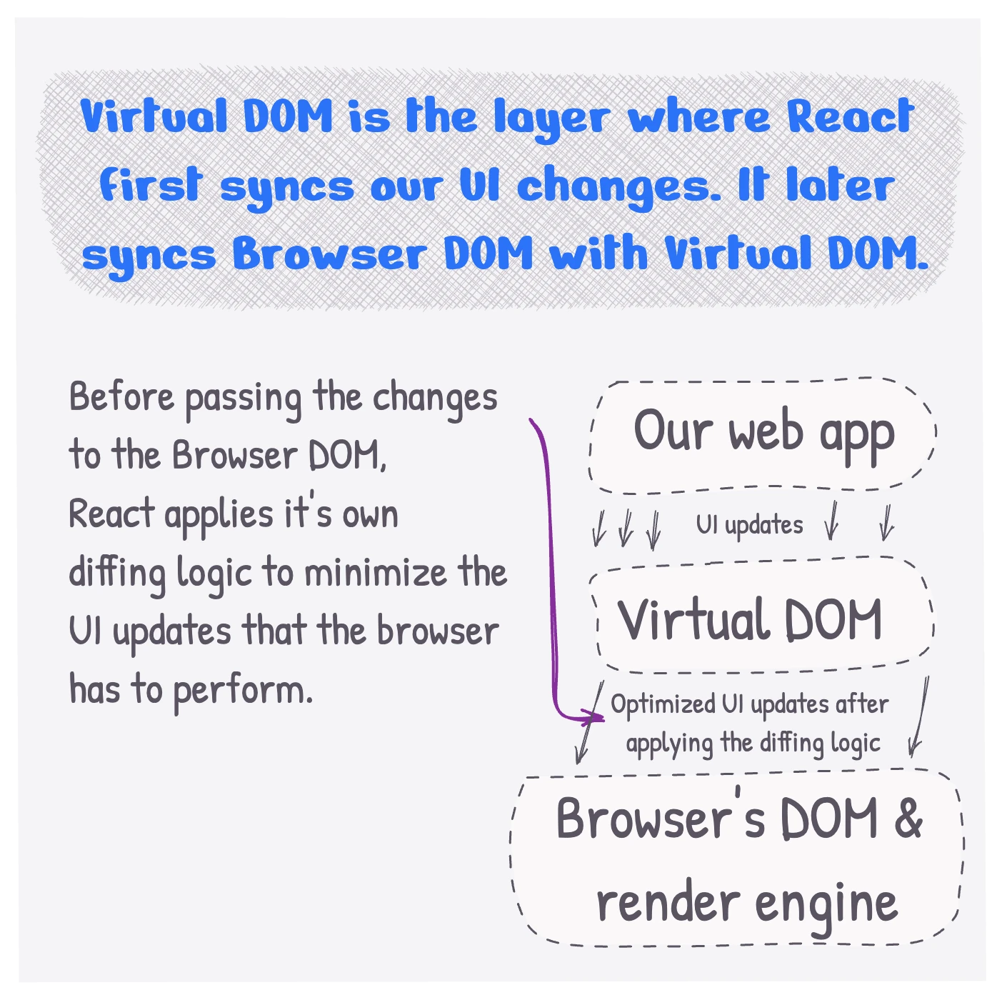

import Comments from 'components/Comments'
import Translations from 'components/Translations'
import Attribution from 'components/Attribution'
import Tweet, {
  AvatarDiegohaz,
  TweetImage,
  UseEvent,
} from 'components/Tweet'

<Translations>{[]}</Translations>

Based on my personal experience of over 2-3 projects and findings on the internet, data-centric application frontends are divided into 5 big modules.

## My React Tech Stack

- [React Core and NextJS Core](react-core): states, effects, rendering, routes, ...
- [Styling Module](): CSS, accessibility, design system
- [Form Module](): user inputs text number dates, mutations
- [Client State Management](client-state-vs-server-state)
- [Server State Management](client-state-vs-server-state)

## Why React?

Lets look at the web world before React with jQuery and PHP:

<Attribution name="Mutating the DOM with Javascript" />

Let's look at the problems:

- DOM mutations are expensive. This will lead to janky experience or unresponsive pages.
- Links to other pages will reload the whole browser, really slow ... [BIDV](https://www.bidv.net/bidvorg/service/)

React came out in 2013 with SPA architecture, and it has a Virtual DOM to minimize DOM update.

<Attribution name="React with VDOM" />

---

That's it for today. If you have any questions, or just leave a comment below. ⬇️

<Comments />
